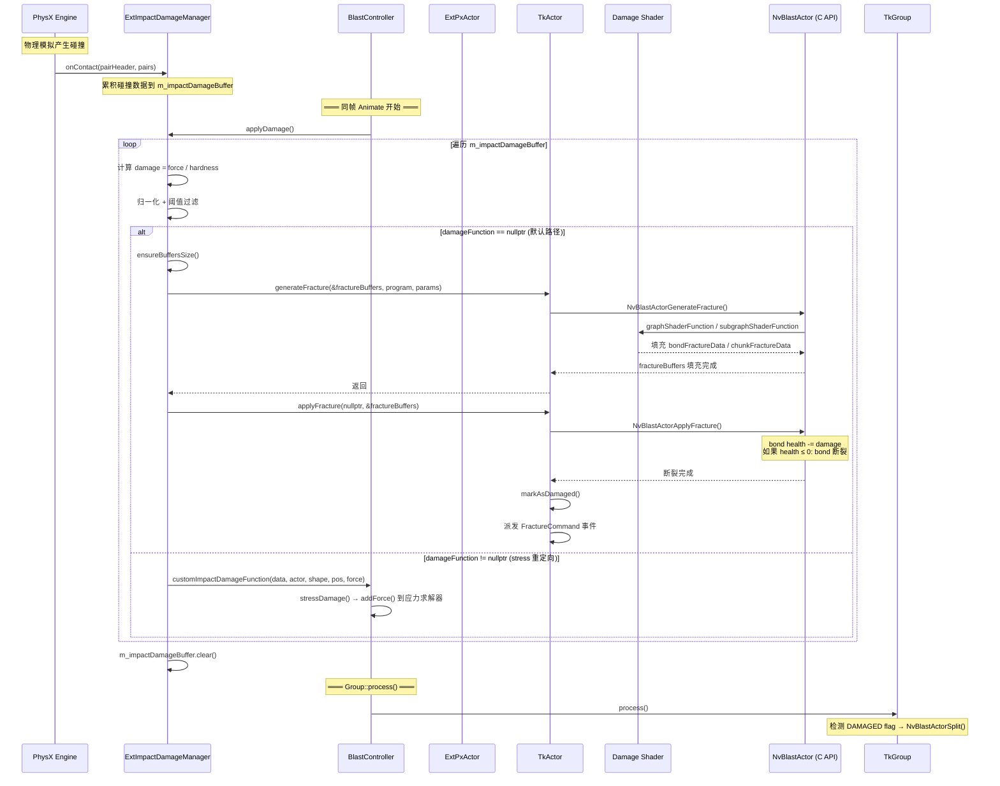
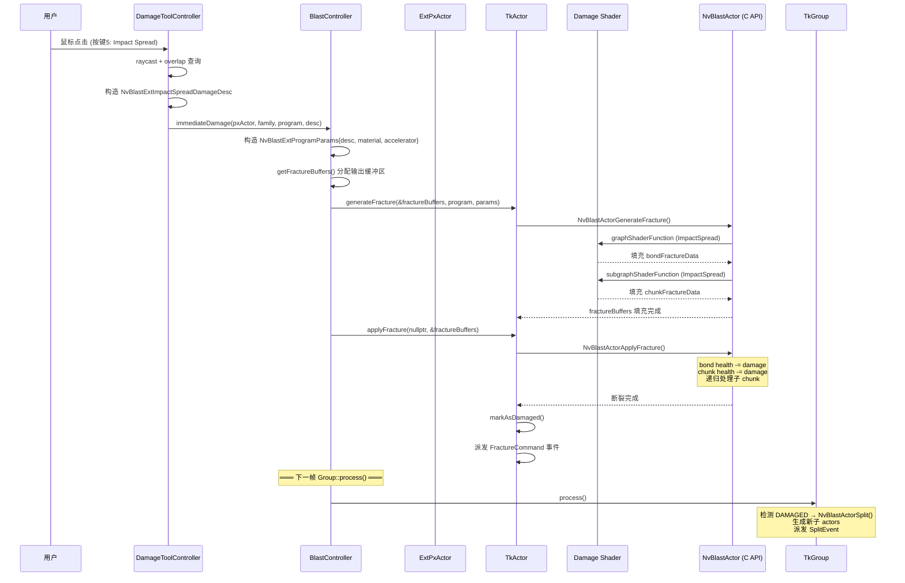
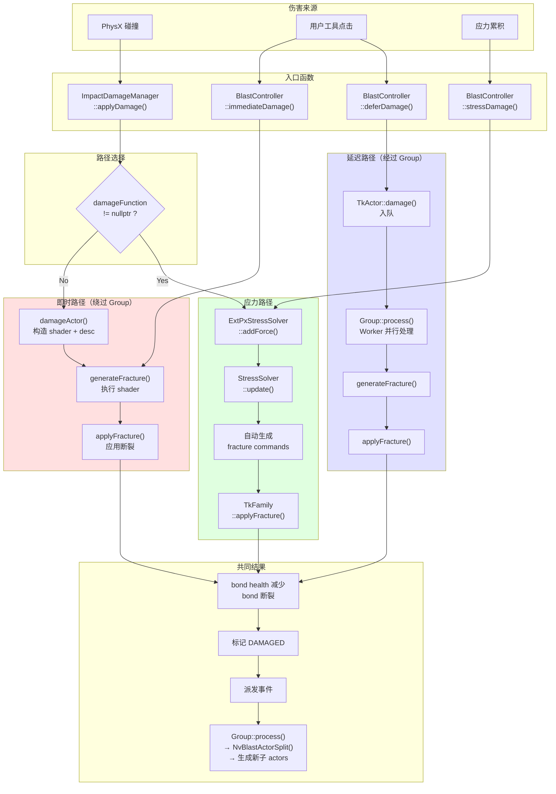

# Blast 伤害路径深度分析：applyDamage vs immediateDamage

本文档聚焦分析 `m_extImpactDamageManager->applyDamage()` 和 `BlastController::immediateDamage()` 两条路径，
澄清它们的关系、区别、以及与物件真正破碎之间的联系。

## 核心结论

1. **两者走同一条底层路径**：都直接调用 `generateFracture()` + `applyFracture()`，绕过 Group/Worker 系统
2. **两者互不影响**：触发场景不同，各自独立执行，不会互相干扰
3. **两者都是"即时"路径**：伤害在调用时立即生效，不需要等待 Group::process()
4. **真正的破碎发生在 `applyFracture()` 中**：bond health 减少 → bond 断裂 → island 检测 → actor 分裂

---

## 一、两条路径的本质

### `applyDamage()` — 碰撞驱动的自动伤害

```
PhysX 碰撞 → onContact() 累积冲量 → 每帧 applyDamage() → 立即破碎
```

- **触发源**：PhysX 物理模拟中两个刚体发生碰撞
- **时机**：每帧 `Animate()` 开头自动调用
- **内部**：对每个累积的碰撞，直接调用 `TkActor::generateFracture()` + `TkActor::applyFracture()`
- **注意**：现有文档中关于此路径走 `TkActor::damage()` (deferred) 的描述是**错误的**

### `immediateDamage()` — 用户工具触发的手动伤害

```
用户点击 → DamageToolController → immediateDamage() → 立即破碎
```

- **触发源**：用户使用 Impact Spread Damage 工具（按键5）点击
- **时机**：用户交互时立即调用
- **内部**：与 `applyDamage()` 的默认路径完全相同的 `generateFracture()` + `applyFracture()` 调用

---

## 二、代码对比

### applyDamage() 的实际路径（NvBlastExtImpactDamageManager.cpp:331-348）

```cpp
void ExtImpactDamageManagerImpl::applyDamage()
{
    for (const ImpactDamageData& data : m_impactDamageBuffer)
    {
        // 转换到本地坐标系
        PxTransform t(data.actor->getPhysXActor().getGlobalPose().getInverse());
        PxVec3 force = t.rotate(data.force);
        PxVec3 position = t.transform(data.position);

        // 尝试自定义 damageFunction（stress 路径）
        if (!damageFn || !damageFn(damageFnData, data.actor, data.shape, position, force))
        {
            damageActor(data.actor, data.shape, position, force);  // 默认路径
        }
    }
    m_impactDamageBuffer.clear();
}
```

`damageActor()` 的内部实现（同文件:363-428）：

```cpp
void ExtImpactDamageManagerImpl::damageActor(ExtPxActor* actor, PxShape*, PxVec3 position, PxVec3 force)
{
    ensureBuffersSize(actor);

    // 计算归一化伤害
    const float damage = force.magnitude() / m_settings.hardness;
    float normalizedDamage = material->getNormalizedDamage(damage);
    if (normalizedDamage < m_settings.damageThresholdMin) return;  // 过滤微小伤害
    normalizedDamage = clamp(normalizedDamage, 0, m_settings.damageThresholdMax);

    // 构造 damage descriptor + program
    NvBlastExtProgramParams programParams(nullptr);
    programParams.material = material;
    programParams.accelerator = actor->getFamily().getPxAsset().getAccelerator();

    if (m_settings.shearDamage)
    {
        NvBlastExtShearDamageDesc desc = { ... };
        program.graphShaderFunction = NvBlastExtShearGraphShader;
        program.subgraphShaderFunction = NvBlastExtShearSubgraphShader;
    }
    else
    {
        NvBlastExtImpactSpreadDamageDesc desc = { ... };
        program.graphShaderFunction = NvBlastExtImpactSpreadGraphShader;
        program.subgraphShaderFunction = NvBlastExtImpactSpreadSubgraphShader;
    }

    // ★ 关键：直接调用 generateFracture + applyFracture，不经过 Group
    NvBlastFractureBuffers fractureEvents = m_fractureBuffers;
    actor->getTkActor().generateFracture(&fractureEvents, program, &programParams);
    actor->getTkActor().applyFracture(nullptr, &fractureEvents);
}
```

### immediateDamage() 的实现（BlastController.cpp:225-234）

```cpp
void BlastController::immediateDamage(ExtPxActor* actor, BlastFamily& family,
                                       const NvBlastDamageProgram& program, const void* damageDesc)
{
    NvBlastExtProgramParams programParams = { damageDesc, &family.getMaterial(),
                                              actor->getFamily().getPxAsset().getAccelerator() };

    NvBlastFractureBuffers& fractureEvents = getFractureBuffers(actor);

    // ★ 完全相同的模式：generateFracture + applyFracture
    actor->getTkActor().generateFracture(&fractureEvents, program, &programParams);
    actor->getTkActor().applyFracture(nullptr, &fractureEvents);
}
```

**关键发现**：两者的最终执行路径完全相同 —— 都是 `TkActor::generateFracture()` + `TkActor::applyFracture()`。

---

## 三、为什么说它们互不影响

### 触发时机不同

| 路径 | 触发时机 | 在 Animate 中的位置 |
|------|---------|---------------------|
| `applyDamage()` | PhysX 碰撞回调累积的伤害 | Animate **开头**（步骤①） |
| `immediateDamage()` | 用户点击工具 | 用户交互时**随时**调用 |

### 内部状态独立

- `applyDamage()` 使用 `ExtImpactDamageManagerImpl` 自己的 `m_fractureBuffers` 和 `m_fractureData`
- `immediateDamage()` 使用 `BlastController` 的 `m_fractureBuffers` 和 `m_fractureData`
- 两者各自分配独立的 `NvBlastFractureBuffers`，互不干扰

### 底层机制

`generateFracture()` 是**只读操作**（读取 actor 的 bond/chunk 数据，执行 shader 写入 fracture commands），
`applyFracture()` 是**写操作**（减少 bond health，标记 chunk 健康值）。
两者在同一线程串行执行，不存在并发问题。多个 damage 作用于同一个 actor 时，效果是**叠加的**（每个 damage 各自减少 bond health）。

---

## 四、与物件真正破碎的关系

### 破碎的完整链路

```
generateFracture()          applyFracture()           真正破碎
─────────────────          ───────────────           ─────────
执行 damage shader    →    减少 bond/chunk health  →  bond 归零
输出 fracture commands      标记 DAMAGED flag         island 检测
                           派发 FractureCommand 事件   actor 分裂
```

### generateFracture — 计算"要打碎什么"

调用链：`TkActor::generateFracture()` → `NvBlastActorGenerateFracture()` → `Actor::generateFracture()`

核心逻辑（NvBlastActor.cpp:190-258）：
- 如果 actor 有多个 graph node → 调用 `graphShaderFunction`（遍历 bond，计算伤害）
- 如果 actor 只有 1 个 graph node → 調用 `subgraphShaderFunction`（计算 chunk 伤害）
- 输出 `NvBlastFractureBuffers`：包含哪些 bond 受损、哪些 chunk 受损、各自多少伤害

### applyFracture — 执行"真正的破碎"

调用链：`TkActor::applyFracture()` → `NvBlastActorApplyFracture()` → `FamilyHeader::applyFracture()`

核心逻辑（NvBlastFamily.cpp:446-557）：

**Bond 断裂**：
```
对每个 bondFracture:
    找到 bond 连接的两个 graph node
    找到拥有这两个 node 的 actor
    调用 actor->damageBond(node0, node1, health)
        → bondHealth -= health
        → 如果 bondHealth ≤ 0: bond 断裂
```

**Chunk 断裂**：
```
对每个 chunkFracture:
    找到拥有该 chunk 的 actor
    调用 actor->damageChunk(chunkIndex, health)
        → chunkHealth -= health
        → 如果 chunkHealth ≤ 0: chunk 破碎，递归处理子 chunk
```

**事件派发**（TkActorImpl::applyFracture, NvBlastTkActorImpl.cpp:322-344）：
```cpp
if (commands->chunkFractureCount > 0 || commands->bondFractureCount > 0)
{
    markAsDamaged();  // 标记 DAMAGED flag
    // 派发 TkFractureCommands 事件到 Tk event queue
    TkFractureCommands* fevt = getFamilyImpl().getQueue().allocData<TkFractureCommands>();
    fevt->tkActorData = *this;
    fevt->buffers = *commands;
    getFamilyImpl().getQueue().addEvent(fevt);
    getFamilyImpl().getQueue().dispatch();
}
```

### 分裂（Split）— 真正的物件碎裂

对于 `immediateDamage()` 和 `applyDamage()`（即时路径），actor 被标记为 DAMAGED 后，
并不会立即分裂。分裂发生在下一帧的 `Group::process()` 中：

```
Animate()
  ├── applyDamage()           ← 标记 DAMAGED（即时路径）
  ├── updatePreSplit()
  ├── Group::process()        ← 检测 DAMAGED → 执行 NvBlastActorSplit() → 生成新 actors
  └── updateAfterSplit()      ← 更新渲染、物理
```

`TkWorker::process()` 中的分裂逻辑（NvBlastTkTaskImpl.cpp:210-226）：
```cpp
if (tkActor->isDamaged())
{
    uint32_t maxActorCount = NvBlastActorGetMaxActorCountForSplit(actorLL);
    splitEvent.newActors = mem->reserveNewActors(maxActorCount);
    j.m_newActorsCount = NvBlastActorSplit(&splitEvent, actorLL, maxActorCount, m_splitScratch);
}
```

---

## 五、第三条路径：Stress Damage

Stress damage 是一个**间接路径**，可以重定向碰撞伤害：

```
碰撞 → applyDamage() → customImpactDamageFunction() → stressDamage() → addForce()
                                                                         ↓
                                                              应力求解器累积应力
                                                                         ↓
                                                              应力超过阈值时自动生成 fracture commands
                                                                         ↓
                                                              TkFamily::applyFracture()
```

当 `m_impactDamageToStressEnabled = true` 时，`applyDamage()` 的碰撞伤害不会直接破碎，
而是被重定向到应力系统。应力系统累积力，当应力超过 bond 强度时才触发破碎。

---

## 六、Sample 中的完整伤害时序

### 每帧主循环（BlastController::Animate）

```
Animate(dt)
  │
  ├─① applyDamage()                    ← 碰撞伤害（即时路径）
  │     遍历累积的碰撞，逐个 generateFracture + applyFracture
  │     如果 stressRedirect=true → 重定向到应力系统
  │
  ├─② updateDraggingStress()           ← 拖拽力注入应力系统
  │
  ├─③ simulationSyncEnd()              ← PhysX 同步
  │
  ├─④ updateImpactDamage()             ← 更新碰撞伤害设置
  │
  ├─⑤ updatePreSplit(dt)               ← 每个 Family:
  │     spawn（首次）、收集 pending actors
  │     ★ 应力系统 update: 累积应力 → 生成 fracture → applyFracture
  │
  ├─⑥ Group::process() + wait()        ← 处理 deferred damage + 分裂
  │     ★ 即时路径标记的 DAMAGED actor 在此执行分裂
  │
  ├─⑦ clear buffers
  │
  ├─⑧ simulationBegin(dt)              ← 开始新一帧物理模拟
  │
  └─⑨ updateAfterSplit(dt)             ← 更新渲染 transform、health 可视化
```

### 用户点击 Impact Spread 工具（按键5）

```
鼠标点击
  │
  ├─ raycast 命中 Blast actor
  ├─ overlap 查询范围内的 actors
  ├─ 构造 NvBlastExtImpactSpreadDamageDesc
  │
  └─ immediateDamage(actor, family, program, desc)
       ├─ generateFracture()            ← 立即执行 shader
       └─ applyFracture()              ← 立即应用断裂
            ├─ bond health 减少
            ├─ 标记 DAMAGED
            └─ 派发 FractureCommand 事件
                 │
                 └─ 下一帧 Group::process() 中执行分裂
```

---

## 七、与 deferDamage 路径的对比

| 特性 | applyDamage | immediateDamage | deferDamage |
|------|-------------|-----------------|-------------|
| **触发方式** | PhysX 碰撞自动 | 用户工具手动 | 用户工具手动 |
| **执行时机** | Animate 开头 | 调用时立即 | Group::process() |
| **调用方式** | generateFracture + applyFracture | generateFracture + applyFracture | TkActor::damage() 入队 |
| **是否经过 Group** | 否 | 否 | 是 |
| **是否支持多线程** | 否（单线程） | 否（单线程） | 是（Worker 并行） |
| **分裂时机** | 下一帧 Group::process | 下一帧 Group::process | 同帧 Group::process |
| **使用的 Shader** | Shear / ImpactSpread | 任意 | 任意 |
| **DamageAccelerator** | 使用 | 使用 | 使用 |

---

## 八、关键源文件索引

| 文件 | 关键行 | 内容 |
|------|--------|------|
| `sdk/extensions/physx/source/physics/NvBlastExtImpactDamageManager.cpp` | 331-348 | `applyDamage()` 实现 |
| `sdk/extensions/physx/source/physics/NvBlastExtImpactDamageManager.cpp` | 363-428 | `damageActor()` — 直接调用 generateFracture + applyFracture |
| `sdk/extensions/physx/source/physics/NvBlastExtImpactDamageManager.cpp` | 177-324 | `onContact()` — 碰撞累积 |
| `samples/SampleBase/blast/BlastController.cpp` | 225-234 | `immediateDamage()` 实现 |
| `samples/SampleBase/blast/BlastController.cpp` | 187-203 | `deferDamage()` 实现 |
| `samples/SampleBase/blast/BlastController.cpp` | 267-282 | `stressDamage()` 实现 |
| `samples/SampleBase/blast/BlastController.cpp` | 357-420 | `Animate()` 主循环 |
| `samples/SampleBase/ui/DamageToolController.cpp` | 132-149 | Impact Spread 工具调用 immediateDamage |
| `sdk/lowlevel/source/NvBlastActor.cpp` | 190-258 | `Actor::generateFracture()` — shader 执行 |
| `sdk/lowlevel/source/NvBlastFamily.cpp` | 446-557 | `FamilyHeader::applyFracture()` — 真正的 bond/chunk 断裂 |
| `sdk/toolkit/source/NvBlastTkActorImpl.cpp` | 307-319 | `TkActorImpl::generateFracture()` |
| `sdk/toolkit/source/NvBlastTkActorImpl.cpp` | 322-344 | `TkActorImpl::applyFracture()` — 事件派发 |
| `sdk/toolkit/source/NvBlastTkTaskImpl.cpp` | 153-264 | `TkWorker::process()` — Group 中的 damage + split |

---

## 九、时序图

### applyDamage() 碰撞伤害流程



### immediateDamage() 手动伤害流程



### 三条伤害路径全景图


