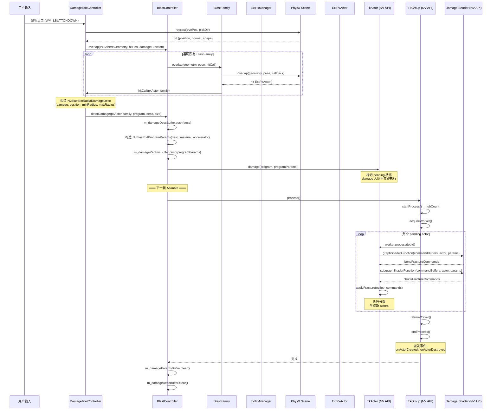
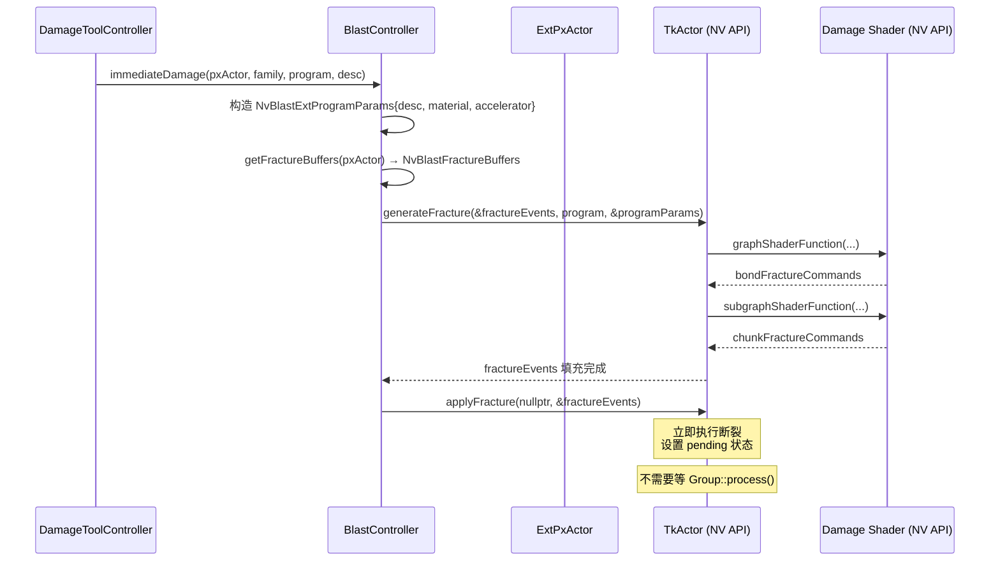
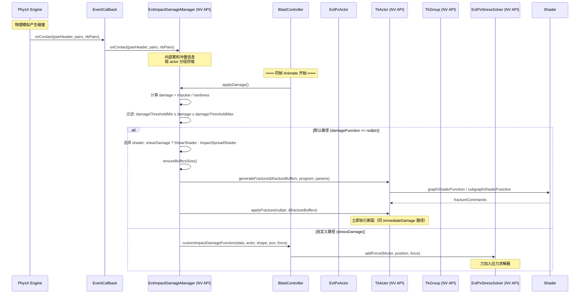
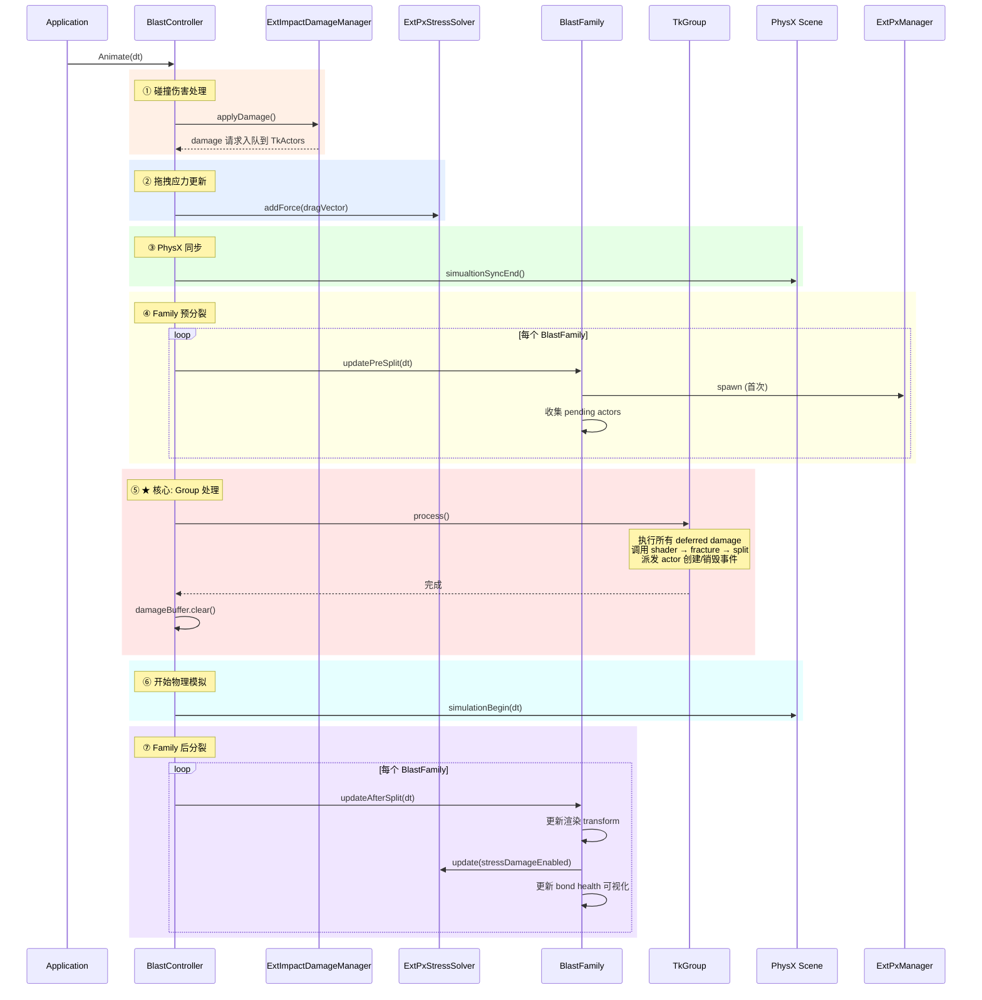

# Blast Samples AddDamage 模块间 API 调用时序图

## 1. 手动伤害 (Defer Path) — 以 Radial Damage 为例



## 2. 手动伤害 (Immediate Path) — Impact Spread



## 3. 碰撞伤害 (Impact Damage Path)



## 4. 每帧主循环 (BlastController::Animate) 总览



## 5. 模块层次关系

```
┌─────────────────────────────────────────────────────┐
│                    用户层 (Application)                │
│  Input → DamageToolController / PhysXController      │
├─────────────────────────────────────────────────────┤
│               Sample 模块层 (BlastController)         │
│  BlastController  ← 管理 damage 入口、buffer、生命周期  │
│  BlastFamily      ← 管理渲染、stress solver、overlap   │
│  BlastAsset       ← 管理 asset + DamageAccelerator    │
├─────────────────────────────────────────────────────┤
│            NV Blast Toolkit API (C++)                 │
│  TkActor::damage()           — deferred damage 入队   │
│  TkActor::generateFracture() — 立即计算 fracture       │
│  TkActor::applyFracture()    — 立即应用 fracture       │
│  TkGroup::process()          — 批量处理所有 damage     │
│  ExtImpactDamageManager      — 碰撞伤害自动管理        │
│  ExtPxManager                — PhysX↔Blast 桥接       │
│  ExtPxStressSolver           — 应力求解                │
├─────────────────────────────────────────────────────┤
│            NV Blast Low-Level API (C)                 │
│  NvBlastActorGenerateFracture()  — shader 执行        │
│  NvBlastActorApplyFracture()     — bond/chunk 断裂     │
│  NvBlastActorSplit()             — island 分裂         │
├─────────────────────────────────────────────────────┤
│                  PhysX SDK                            │
│  PxScene::overlap() / raycast()  — 空间查询            │
│  PxSimulationEventCallback       — 碰撞回调            │
│  PxRigidDynamic                  — 刚体模拟            │
└─────────────────────────────────────────────────────┘
```
