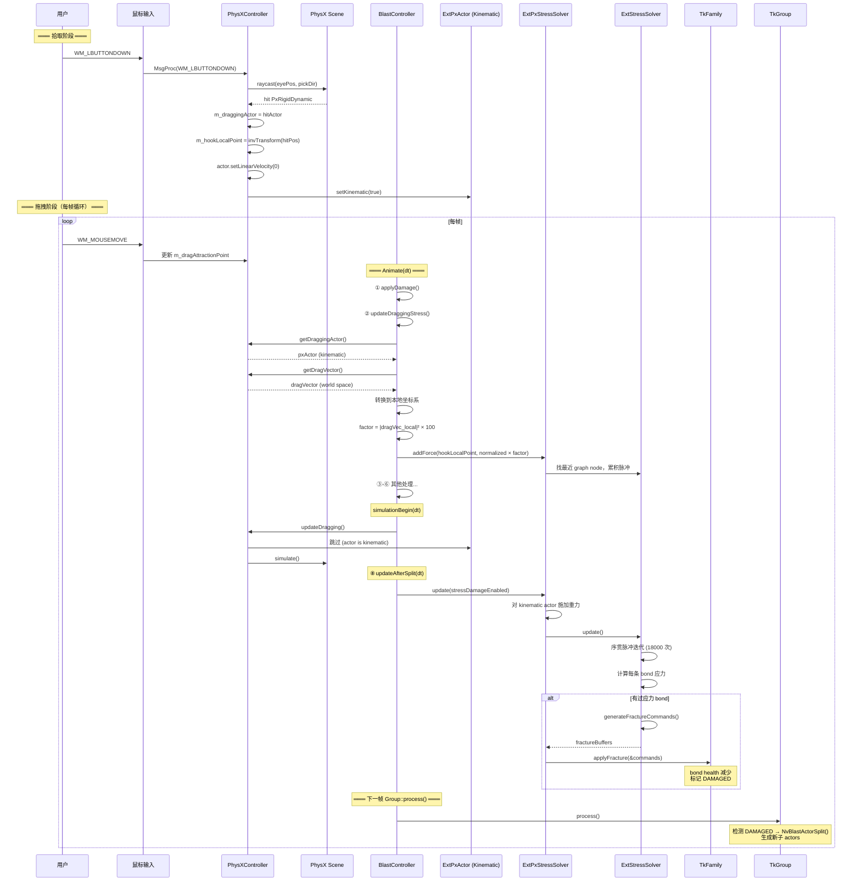
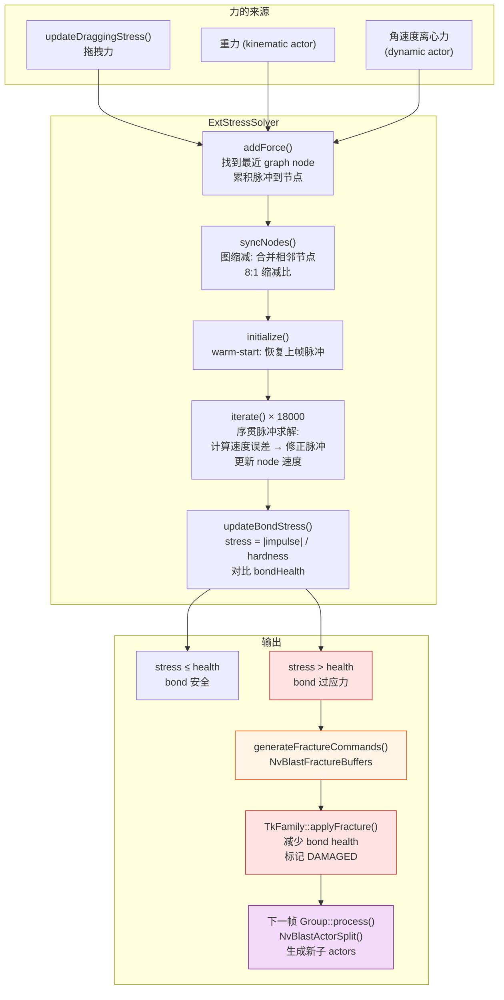

# 拖拽应力破碎系统 (Dragging Stress Damage) 完整分析

## 概述

拖拽应力系统允许用户通过鼠标拖拽物体，当拖拽力超过 bond 强度时，物体自动破碎。
整个流程跨越 5 个模块层：用户输入 → PhysX 物理 → 应力求解 → 断裂 → 分裂。

核心原理：被拖拽的物体设为 kinematic（不受物理力影响），但应力求解器会将拖拽向量
转化为内部力，计算每个 bond 的应力。当应力超过 bond 健康值时，生成 fracture commands
并应用到 TkFamily，触发真正的破碎。

---

## 整体框架

```
┌─────────────────────────────────────────────────────────────────┐
│                      用户输入层                                  │
│  WM_LBUTTONDOWN → 拾取 actor，记录 hook point                    │
│  WM_MOUSEMOVE   → 更新 attraction point                         │
│  WM_LBUTTONUP   → 释放 actor                                    │
├─────────────────────────────────────────────────────────────────┤
│                   PhysXController                                │
│  updateDragging()   → 对 dynamic actor 施加弹簧阻尼力             │
│  getDragVector()    → 提供拖拽向量给应力系统                      │
├─────────────────────────────────────────────────────────────────┤
│                   BlastController                                │
│  updateDraggingStress() → 将拖拽向量转为应力系统力                 │
├─────────────────────────────────────────────────────────────────┤
│                   ExtPxStressSolver (PhysX 层)                   │
│  addForce()  → 累积力到节点                                      │
│  update()    → 每帧迭代应力求解，生成 fracture commands            │
├─────────────────────────────────────────────────────────────────┤
│                   ExtStressSolver (纯算法层)                      │
│  SequentialImpulseSolver → 序贯脉冲约束求解                       │
│  SupportGraphProcessor   → support graph 映射 + 应力计算          │
│  generateFractureCommands → 输出 NvBlastFractureBuffers           │
├─────────────────────────────────────────────────────────────────┤
│                   TkFamily / TkActor (Blast Toolkit)              │
│  applyFracture()  → 应用断裂，减少 bond health                    │
│  Group::process() → 执行 NvBlastActorSplit() 分裂                │
└─────────────────────────────────────────────────────────────────┘
```

---

## 一、用户输入与拖拽拾取

### 鼠标拾取流程

```
WM_LBUTTONDOWN
  │
  ├─ 从摄像机发射射线 (eyePos + pickDir * farPlane)
  │
  ├─ PxScene::raycast() 命中 PxRigidDynamic?
  │   ├─ No → 忽略
  │   └─ Yes ↓
  │
  ├─ m_draggingActor = hitActor
  ├─ m_dragActorHookLocalPoint = invTransform(hitPos)   ← 本地坐标系的抓取点
  ├─ m_dragDistance = length(hitPos - eyePos)            ← 锁定拖拽距离
  ├─ actor->setLinearVelocity(0)
  └─ actor->setAngularVelocity(0)
```

### 拖拽力更新（每帧）

```
WM_MOUSEMOVE (持续更新)
  │
  ├─ 更新 m_dragAttractionPoint = eyePos + pickDir * m_dragDistance
  │
  └─ (每帧 simulationBegin 中)
     updateDragging()
       │
       ├─ hookPoint = actor.globalPose.transform(localHookPoint)  ← 当前世界坐标
       ├─ m_dragVector = attractionPoint - hookPoint               ← 拖拽方向+距离
       │
       └─ 如果 actor 不是 kinematic:
            impulse = (dragVector * 10 - 2 * velocity) * dt * mass
            PxRigidBodyExt::addForceAtLocalPos(actor, impulse, localHookPoint)
```

### 为什么需要 kinematic?

当物体被拾取时，它被设为 kinematic 以避免物理模拟干扰拖拽行为。
但 kinematic actor 不受 PhysX 力的影响，因此需要应力求解器来感知拖拽力。

---

## 二、拖拽力注入应力系统

### BlastController::updateDraggingStress()

每帧在 `Animate()` 中调用（在物理模拟之前）。

```cpp
void BlastController::updateDraggingStress()
{
    auto actor = physxController.getDraggingActor();
    if (actor)
    {
        ExtPxActor* pxActor = m_extPxManager->getActorFromPhysXActor(*actor);
        if (pxActor &&
            pxActor->getTkActor().getGraphNodeCount() > 1 &&   // 必须是多 chunk actor
            pxActor->getPhysXActor().isKinematic())              // 必须是 kinematic
        {
            ExtPxStressSolver* solver = pxActor->getFamily().userData;
            PxTransform t(pxActor->getPhysXActor().getGlobalPose().getInverse());
            PxVec3 dragVector = t.rotate(getDragVector());       // 世界→本地坐标
            float factor = dragVector.magnitudeSquared() * m_draggingToStressFactor;
            solver->addForce(actorLL, hookLocalPoint, dragVector.normalized() * factor);
        }
    }
}
```

关键参数：
- `m_draggingToStressFactor = 100.0f`（默认值）
- 力的大小 = `|dragVector_local|² × 100`
- 力的方向 = `dragVector_local` 的归一化方向
- 力的施加点 = `hookLocalPoint`（拾取时记录的本地坐标）

---

## 三、应力求解器

### 架构

```
ExtPxStressSolver (PhysX 层)
  │  管理 PhysX actor 生命周期
  │  提供重力/角速度力注入
  │  调用底层求解器
  │
  └─ ExtStressSolver (纯算法层)
       │
       ├─ SupportGraphProcessor
       │    ├─ 管理 Blast support graph 到 solver graph 的映射
       │    ├─ 图缩减 (graph reduction) — 合并相邻节点减少计算量
       │    ├─ 累积外部力 (addForce)
       │    └─ 调用 SequentialImpulseSolver 求解
       │
       └─ SequentialImpulseSolver
            ├─ 每个 bond 存储累积线性/角脉冲
            ├─ 每个 node 存储速度、逆质量、逆惯性
            └─ 迭代求解约束，更新 node 速度和 bond 脉冲
```

### 序贯脉冲求解算法

每帧执行 `bondIterationsPerFrame`（默认 18000）次迭代。

每次迭代遍历所有 bond：

```
对每条 bond (nodeA ↔ nodeB):
  │
  ├─ 计算相对速度误差:
  │    vLinear  = (velA - angA × offsetA) - (velB + angB × offsetB)
  │    vAngular = angA - angB
  │
  ├─ 计算修正脉冲:
  │    impulseLinear  = -vLinear × weightedMass × 0.5
  │    impulseAngular = -vAngular × weightedInertia × 0.5
  │
  ├─ 累积到 bond 的总脉冲:
  │    bond.impulseLinear  += impulseLinear
  │    bond.impulseAngular += impulseAngular
  │
  └─ 应用速度修正到两端 node:
       velA += impulseLinear * invMassA
       velB -= impulseLinear * invMassB
       angA += impulseAngular * invInertiaA
       angB -= impulseAngular * invInertiaB
```

### 图缩减 (Graph Reduction)

为了提高性能，solver 将 support graph 按层级合并：
- Level 0: 原始节点
- Level 1: 每 2 个相邻节点合并为 1 个
- Level 2: 每 4 个相邻节点合并为 1 个
- Level N: 每 2^N 个相邻节点合并为 1 个

默认 `graphReductionLevel = 3`，即约 8:1 的缩减比。
合并后的节点质量 = 各子节点质量和，位置 = 体积加权平均。

### 应力计算

求解完成后，计算每条 bond 的应力：

```
bondStress = (|bond.impulseLinear| × stressLinearFactor
            + |bond.impulseAngular| × stressAngularFactor)
            / (blastBondCount × hardness)
```

默认参数：
- `stressLinearFactor = 0.25`
- `stressAngularFactor = 0.75`
- `hardness = 1000.0`

**判定条件**：当 `bondStress > bondHealth[blastBondIndex]` 时，该 bond 过应力。

---

## 四、断裂生成与应用

### generateFractureCommands

```cpp
void ExtStressSolver::generateFractureCommands(NvBlastFractureBuffers& commands)
{
    for each solverBond:
        if (bondHealth > 0 && stress > bondHealth)
            commands.bondFractures[count++] = { nodeIndex0, nodeIndex1, stress };
}
```

### applyFracture (ExtPxStressSolver::update)

```cpp
void ExtPxStressSolverImpl::update(bool doDamage)
{
    // 对 kinematic actor 施加重力
    for each kinematic actor:
        solver.addGravityForce(actorLL, localGravity);

    // 对 dynamic actor 施加角速度离心力
    for each dynamic actor:
        solver.addAngularVelocity(actorLL, centerMass, angularVelocity);

    // 迭代求解
    m_solver->update();

    // 如果启用 stress damage 且有过应力 bond
    if (doDamage && solver.getOverstressedBondCount() > 0)
    {
        NvBlastFractureBuffers commands;
        solver.generateFractureCommands(commands);
        if (commands.bondFractureCount > 0)
        {
            family.getTkFamily().applyFracture(&commands);  // ★ 应用断裂
        }
    }
}
```

### applyFracture 之后

`TkFamily::applyFracture()` 将断裂命令路由到正确的 `TkActor`：
- 找到每条 bond 连接的两个 chunk 所属的 actor
- 调用 `TkActor::applyFracture(nullptr, &commands)`
- 减少 bond health，标记 DAMAGED
- 派发 `TkFractureCommands` 事件

下一帧 `Group::process()` 中：
- 检测 DAMAGED flag
- 执行 `NvBlastActorSplit()` — island 检测 + 分裂
- 生成新的子 actors
- 派发 `TkSplitEvent` 事件

---

## 五、每帧时序

### BlastController::Animate() 中的完整时序

```
Animate(dt)
  │
  ├─① applyDamage()                    ← 碰撞伤害（即时路径）
  │
  ├─② updateDraggingStress()           ← ★ 将拖拽力注入应力求解器
  │     条件: actor 被拖拽 + kinematic + graphNodeCount > 1
  │     力 = |dragVector|² × factor × direction
  │
  ├─③ fillDebugRender()
  │
  ├─④ simulationSyncEnd()              ← PhysX 同步
  │
  ├─⑤ updatePreSplit(dt)               ← 每个 Family:
  │     首次 spawn + reloadStressSolver
  │
  ├─⑥ Group::process() + wait()        ← 处理 deferred damage + 分裂
  │
  ├─⑦ simulationBegin(dt)              ← PhysX:
  │     updateDragging()                ← 对 dynamic actor 施加弹簧阻尼力
  │     PhysX simulate()
  │
  └─⑧ updateAfterSplit(dt)             ← 每个 Family:
        stressSolver->update(doDamage)  ← ★ 应力求解 + 生成断裂
        ├─ 累积重力/角速度力
        ├─ 序贯脉冲迭代 (18000 次)
        ├─ 计算 bond 应力
        ├─ 如果有过应力 bond:
        │    generateFractureCommands()
        │    TkFamily::applyFracture()
        └─ 更新渲染 transform
```

---

## 六、时序图

### 完整拖拽应力破碎流程



### 应力求解器内部流程



---

## 七、关键参数

### 拖拽参数

| 参数 | 默认值 | 说明 |
|------|--------|------|
| `m_draggingToStressFactor` | 100.0 | 拖拽力→应力的缩放因子 |
| `DRAGGING_FORCE_FACTOR` | 10.0 | PhysX 弹簧力系数 |
| `DRAGGING_VELOCITY_FACTOR` | 2.0 | PhysX 阻尼系数 |

### 应力求解器参数

| 参数 | 默认值 | 说明 |
|------|--------|------|
| `hardness` | 1000.0 | 材料硬度，应力 = impulse / hardness |
| `stressLinearFactor` | 0.25 | 线性应力权重 |
| `stressAngularFactor` | 0.75 | 角应力权重 |
| `bondIterationsPerFrame` | 18000 | 每帧总迭代次数（分摊到各 bond） |
| `graphReductionLevel` | 3 | 图缩减层级（约 8:1 缩减） |

### UI 控制项

| 控件 | 位置 | 说明 |
|------|------|------|
| Dragging To Stress Factor | BlastController UI | 拖拽力缩放 |
| Stress Solver Enabled | BlastFamily UI | 开关应力求解器 |
| Stress Damage Enabled | BlastFamily UI | 开关应力→断裂（关闭时只计算不破碎） |
| Material Hardness | BlastFamily UI | 材料硬度 |
| Bond Iterations Per Frame | BlastFamily UI | 迭代精度 |
| Graph Reduction Level | BlastFamily UI | 性能/精度权衡 |

---

## 八、与其他伤害路径的关系

```
拖拽应力 ←── updateDraggingStress() 注入力
    │
碰撞应力 ←── customImpactDamageFunction() 注入力
    │
    ▼
ExtStressSolver (统一的应力求解器)
    │
    ├─ 累积所有来源的力
    ├─ 每帧迭代求解
    ├─ 当应力 > bondHealth → generateFractureCommands
    │
    └─ TkFamily::applyFracture() → 破碎
```

拖拽应力和碰撞应力共享同一个 `ExtStressSolver` 实例。
两者注入的力会叠加，共同影响 bond 应力。
最终的破碎判定是所有力累积后的结果。

---

## 九、关键源文件索引

| 文件 | 关键行 | 内容 |
|------|--------|------|
| `samples/SampleBase/physx/PhysXController.cpp` | 419-472 | `MsgProc()` 鼠标拾取 |
| `samples/SampleBase/physx/PhysXController.cpp` | 350-411 | `updateDragging()` PhysX 弹簧阻尼力 |
| `samples/SampleBase/physx/PhysXController.h` | 215-228 | `getDragVector()` / `getDraggingActor()` |
| `samples/SampleBase/blast/BlastController.cpp` | 297-320 | `updateDraggingStress()` 力注入 |
| `samples/SampleBase/blast/BlastController.cpp` | 357-420 | `Animate()` 主循环时序 |
| `samples/SampleBase/blast/BlastController.h` | 296 | `m_draggingToStressFactor` 声明 |
| `samples/SampleBase/blast/BlastFamily.cpp` | 135-166 | `updateAfterSplit()` 调用 stressSolver->update() |
| `samples/SampleBase/blast/BlastFamily.cpp` | 329-342 | `reloadStressSolver()` 创建求解器 |
| `sdk/extensions/physx/source/physics/NvBlastExtPxStressSolverImpl.cpp` | 174-208 | `update()` PhysX 层应力求解入口 |
| `sdk/extensions/physx/source/physics/NvBlastExtPxStressSolverImpl.cpp` | 56-151 | 构造函数：初始化 solver |
| `sdk/extensions/stress/source/NvBlastExtStressSolver.cpp` | 231-308 | `SequentialImpulseSolver::iterate()` 核心算法 |
| `sdk/extensions/stress/source/NvBlastExtStressSolver.cpp` | 565-583 | `SupportGraphProcessor::solve()` 求解入口 |
| `sdk/extensions/stress/source/NvBlastExtStressSolver.cpp` | 606-634 | `updateBondStress()` 应力计算 |
| `sdk/extensions/stress/source/NvBlastExtStressSolver.cpp` | 650-790 | `syncNodes()` 图缩减 |
| `sdk/extensions/stress/source/NvBlastExtStressSolver.cpp` | 1260-1289 | `addForce()` 外部力注入 |
| `sdk/extensions/stress/source/NvBlastExtStressSolver.cpp` | 1417-1443 | `generateFractureCommands()` 断裂命令生成 |
| `sdk/extensions/stress/include/NvBlastExtStressSolver.h` | 56-71 | `ExtStressSolverSettings` 参数定义 |
